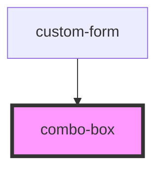

# combo-box

<!-- Auto Generated Below -->

## Properties

| Property     | Attribute     | Description | Type      | Default     |
| ------------ | ------------- | ----------- | --------- | ----------- |
| `allowInput` | `allow-input` |             | `boolean` | `false`     |
| `label`      | `label`       |             | `string`  | `undefined` |

## Events

| Event           | Description | Type                  |
| --------------- | ----------- | --------------------- |
| `comboBoxInput` |             | `CustomEvent<string>` |

## Dependencies

### Used by

 - [custom-form](../custom-form)

### Graph

----------------------------------------------

*Built with [StencilJS](https://stenciljs.com/)*
