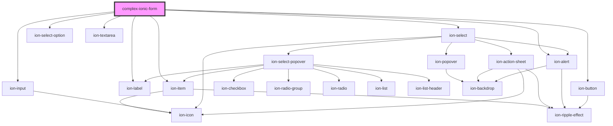

# complex-ionic-form

<!-- Auto Generated Below -->

## Dependencies

### Depends on

- ion-item
- ion-label
- ion-input
- ion-select
- ion-select-option
- ion-textarea
- ion-button
- ion-alert

### Graph

----------------------------------------------

*Built with [StencilJS](https://stenciljs.com/)*
