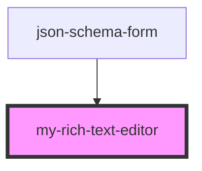

# my-rich-text-editor

<!-- Auto Generated Below -->

## Properties

| Property           | Attribute           | Description                                                       | Type      | Default     |
| ------------------ | ------------------- | ----------------------------------------------------------------- | --------- | ----------- |
| `disableQuickbars` | `disable-quickbars` |                                                                   | `boolean` | `false`     |
| `disabled`         | `disabled`          |                                                                   | `boolean` | `false`     |
| `fontFamily`       | `font-family`       |                                                                   | `string`  | `'Calibri'` |
| `fontSize`         | `font-size`         |                                                                   | `string`  | `undefined` |
| `initialValue`     | `initial-value`     |                                                                   | `string`  | `undefined` |
| `name`             | `name`              |                                                                   | `string`  | `''`        |
| `placeholder`      | `placeholder`       | Optional placeholder text displayed when the form field is empty. | `string`  | `undefined` |
| `value`            | `value`             |                                                                   | `string`  | `''`        |

## Events

| Event            | Description | Type                  |
| ---------------- | ----------- | --------------------- |
| `contentChanged` |             | `CustomEvent<any>`    |
| `editorBlur`     |             | `CustomEvent<void>`   |
| `editorFocus`    |             | `CustomEvent<void>`   |
| `valueChange`    |             | `CustomEvent<string>` |
| `valueChanged`   |             | `CustomEvent<any>`    |

## Dependencies

### Used by

 - [json-schema-form](../json-schema-form)

### Graph

----------------------------------------------

*Built with [StencilJS](https://stenciljs.com/)*
