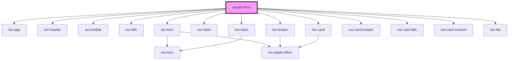

# simple-form

<!-- Auto Generated Below -->

## Properties

| Property    | Attribute    | Description | Type            | Default     |
| ----------- | ------------ | ----------- | --------------- | ----------- |
| `firstName` | `first-name` |             | `string`        | `undefined` |
| `history`   | --           |             | `RouterHistory` | `undefined` |
| `lastName`  | `last-name`  |             | `string`        | `undefined` |

## Dependencies

### Depends on

- ion-app
- ion-header
- ion-toolbar
- ion-title
- ion-item
- ion-label
- ion-input
- ion-button
- ion-card
- ion-card-header
- ion-card-title
- ion-card-content
- ion-list

### Graph

----------------------------------------------

*Built with [StencilJS](https://stenciljs.com/)*
