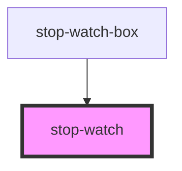

# stop-watch

<!-- Auto Generated Below -->

## Properties

| Property       | Attribute      | Description | Type     | Default     |
| -------------- | -------------- | ----------- | -------- | ----------- |
| `hours`        | `hours`        |             | `string` | `undefined` |
| `milliseconds` | `milliseconds` |             | `string` | `undefined` |
| `minutes`      | `minutes`      |             | `string` | `undefined` |
| `seconds`      | `seconds`      |             | `string` | `undefined` |

## Dependencies

### Used by

 - [stop-watch-box](../stop-watch-box)

### Graph

----------------------------------------------

*Built with [StencilJS](https://stenciljs.com/)*
