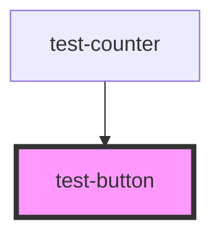

# test-button

<!-- Auto Generated Below -->

## Properties

| Property   | Attribute   | Description | Type               | Default     |
| ---------- | ----------- | ----------- | ------------------ | ----------- |
| `buttonId` | `button-id` |             | `string`           | `undefined` |
| `color`    | `color`     |             | `"green" \| "red"` | `undefined` |

## Events

| Event           | Description | Type               |
| --------------- | ----------- | ------------------ |
| `buttonClicked` |             | `CustomEvent<any>` |

## Dependencies

### Used by

 - [test-counter](../test-counter)

### Graph

----------------------------------------------

*Built with [StencilJS](https://stenciljs.com/)*
