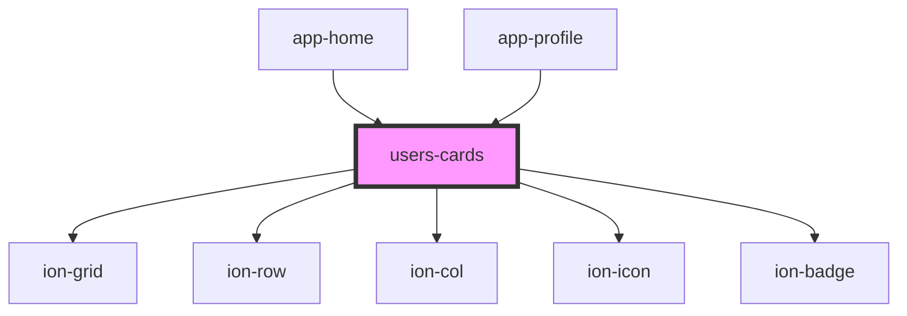

# users-cards

<!-- Auto Generated Below -->

## Properties

| Property  | Attribute | Description | Type     | Default     |
| --------- | --------- | ----------- | -------- | ----------- |
| `columns` | `columns` |             | `string` | `undefined` |

## Dependencies

### Used by

 - [app-home](../app-home)
 - [app-profile](../app-profile)

### Depends on

- ion-grid
- ion-row
- ion-col
- ion-icon
- ion-badge

### Graph

----------------------------------------------

*Built with [StencilJS](https://stenciljs.com/)*
